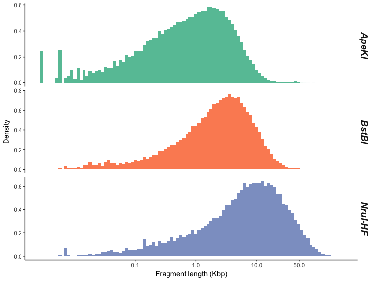

Digest genome
================
Lucas Nell
19 March 2017

-   [Read genome](#read-genome)
-   [Make restriction enzyme data frame](#make-restriction-enzyme-data-frame)
-   [Digest genome](#digest-genome)
    -   [Accounting for missing data](#accounting-for-missing-data)
    -   [Digestion summary](#digestion-summary)
-   [Choosing enzymes and visualizing fragment sizes](#choosing-enzymes-and-visualizing-fragment-sizes)
-   [Writing to fasta files](#writing-to-fasta-files)
-   [Session info and package versions](#session-info-and-package-versions)

*Updated 24 March 2017*

In this script I perform in silico digestions of the aphid genome using multiple restriction enzymes. Once enzymes are chosen, I write the resulting fragments to fasta files.

**Loading packages:**

``` r
suppressPackageStartupMessages({
        library(SimRAD)
        library(dplyr)
        library(purrr)
        library(tidyr)
        library(ggplot2)
    })
```

*Note*: Installing `SimRAD` requires the following code:

``` r
source('https://bioconductor.org/biocLite.R')
biocLite('Biostrings')
biocLite('ShortRead')
biocLite('zlibbioc')
install.packages('SimRAD')
```

Read genome
===========

This converts the compressed fasta file of the aphid genome to a single string containing the sequences in the file. (It should take ~20 seconds.)

(See the `README.md` file for why I'm including `./genome_data/` in file paths.)

``` r
genome_seq <- ref.DNAseq('./genome_data/aphid_genome.fa.gz', subselect.contigs = FALSE)
```

If you want to test this script without using as much RAM or time, you can run the following code instead:

``` r
set.seed(1)
genome_seq <- ref.DNAseq('./genome_data/aphid_genome.fa.gz', prop.contigs = 0.1)
```

Make restriction enzyme data frame
==================================

Here is a table of the restriction enzymes considered and their restriction-site sequences:

| enzyme    |   site1   |  site2 |
|:----------|:---------:|:------:|
| *ApeKI*   |   G/CAGC  | G/CTGC |
| *SbfI*    | CCTGCA/GG |        |
| *PstI*    |  CTGCA/G  |        |
| *EcoT22I* |  ATGCA/T  |        |
| *BstBI*   |  TT/CGAA  |        |
| *AscI*    | GG/CGCGCC |        |
| *BspEI*   |  T/CCGGA  |        |
| *AclI*    |  AA/CGTT  |        |
| *FspI*    |  TGC/GCA  |        |
| *MluI-HF* |  A/CGCGT  |        |
| *NruI-HF* |  TCG/CGA  |        |

Below is a data frame of the above table:

``` r
re_df <- data_frame(enzyme = c('ApeKI', 'SbfI', 'PstI', 'EcoT22I', 'BstBI', 'AscI', 
                               'BspEI', 'AclI', 'FspI', 'MluI-HF', 'NruI-HF'),
                    sites = list(c('G', 'CAGC', 'G', 'CTGC'), c('CCTGCA', 'GG'),
                                 c('CTGCA', 'G'), c('ATGCA', 'T'), c('TT', 'CGAA'), 
                                 c('GG', 'CGCGCC'), c('T', 'CCGGA'), c('AA', 'CGTT'), 
                                 c('TGC', 'GCA'), c('A', 'CGCGT'), c('TCG','CGA'))) %>% 
    filter(!enzyme %in% c('SbfI', 'PstI', 'EcoT22I', 'AscI', 'BspEI', 'FspI'))
```

The restriction enzymes below were filtered out (reasons and link to referencing site follow):

-   *SbfI*: Not blocked by CpG methylase ([link](https://www.neb.com/products/r0642-sbfi))
-   *PstI*: Not blocked by CpG methylase ([link](https://www.neb.com/products/r0140-psti))
-   *EcoT22I*: "... not sensitive to dam, dcm, or CG methylation" ([link](https://tools.thermofisher.com/content/sfs/manuals/15240501.pdf))
-   *AscI*: "AscI is strongly inhibited by NaCl and ammonium acetate" ([link](https://www.neb.com/products/r0558-asci))
-   *BspEI*: Only impaired by CpG methylase ([link](https://www.neb.com/products/r0540-bspei))
-   *FspI*: "Ligation is 25%–75%." ([link](https://www.neb.com/products/r0135-fspi))

Digest genome
=============

This function runs an in silico digestion of the genome, given an enzyme's site sequences as a character vector:

``` r
digest_enzyme <- function(enzyme_sites, dna_seq = genome_seq) {
    if (is.list(enzyme_sites)) {
        enzyme_sites <- enzyme_sites[[1]]
    }
    if ((length(enzyme_sites) %% 2) != 0) {
        stop(paste('enzyme_sites argument must be of even length, separately providing',
                   'sequences for 5 prime and 3 prime sides of each site'))
    }
    names(enzyme_sites) <- 
        c('cut_site_5prime1', 'cut_site_3prime1', 
          'cut_site_5prime2', 'cut_site_3prime2',  
          'cut_site_5prime3', 'cut_site_3prime3', 
          'cut_site_5prime4', 'cut_site_3prime4')[1:length(enzyme_sites)]
    
    call_list <- as.list(c(DNAseq = dna_seq, verbose = FALSE, enzyme_sites))
    
    dig <- do.call(insilico.digest, call_list)
    
    return(dig)
}
```

Running that on all digestion enzymes in `re_df` (**Warning:** this takes ~ 4.5 minutes and can use &gt; 4GB RAM):

``` r
re_df <- re_df %>% 
    mutate(digest = lapply(sites, digest_enzyme))
```

### Accounting for missing data

> From six sequencing lanes, we identified 809,651 sequence tags (at least five times) from one or both flanks of 654,998 of the 2.1 million *ApeKI* cut sites lying within the single copy genomic fraction.

([Elshire et al. 2011](http://dx.plos.org/10.1371/journal.pone.0019379), p 5)

From above, I'm creating an object storing the proportion of cut sites that I'll assume get sequenced:

``` r
seq_p <- 654998 / 2.1e6
```

### Digestion summary

Printing summary of each digestion, where all numbers assume `seq_p` proportion of sites get sequenced:

    ## ---    ApeKI    ----
    ## Loci per Mbp = 183.12 
    ## Total loci = 99,192 
    ## 
    ## ---    BstBI    ----
    ## Loci per Mbp = 78.11 
    ## Total loci = 42,312 
    ## 
    ## ---    AclI    ----
    ## Loci per Mbp = 93.02 
    ## Total loci = 50,386 
    ## 
    ## ---    MluI-HF    ----
    ## Loci per Mbp = 48.41 
    ## Total loci = 26,224 
    ## 
    ## ---    NruI-HF    ----
    ## Loci per Mbp = 23.08 
    ## Total loci = 12,503

Choosing enzymes and visualizing fragment sizes
===============================================

From the summary above, I'll use *ApeKI* as a common restriction enzyme, *BstBI* as intermediate, and *NruI-HF* as rare.

``` r
chosen_res <- c('ApeKI', 'BstBI', 'NruI-HF')
```

Below are histograms of the fragment sizes for the genome digested with each enzyme.



Writing to fasta files
======================

The `DNAStringSet` function is from the `Biostrings` package, and `writeFasta` is from the `ShortRead` package. Both of these packages should already be loaded from by `SimRAD`.

The below code makes a list of `DNAStringSet` objects with individual sequence names set to `seq_X`, where `X` goes from 1 to the number of sequences.

``` r
write_list <- re_df %>% 
    filter(enzyme %in% chosen_res) %>% 
    split(.$enzyme) %>% 
    map(~ DNAStringSet(.x$digest[[1]])) %>% 
    map(~ magrittr::set_names(.x, paste0('seq_', 1:length(.x))))
write_list
```

    ## $ApeKI
    ##   A DNAStringSet instance of length 318022
    ##          width seq                                     names               
    ##      [1]   135 TTTACAATTGCTATTGTA...AATGACAATGTCCGTAAG seq_1
    ##      [2]  2325 CAGCTCAAAAAGAGTCAA...AGATATTTTACCATTTGG seq_2
    ##      [3]  4189 CTGCTTTTTTTAAAATAA...TGGCGCAACTGGTGTTTG seq_3
    ##      [4]  1122 CAGCAGGCGTGAACAAGG...CCGTGAACCCTGTCCAGG seq_4
    ##      [5]   880 CAGCGGCGGCGTCGTTTG...CGGCCGTCTCACGCGTCG seq_5
    ##      ...   ... ...
    ## [318018]    51 CAGCGGCTGATCTCCAAA...ACCGATCCTTTTCTGCGG seq_318018
    ## [318019]    15 CTGCCGCAAGTATCG                         seq_318019
    ## [318020]  1628 CTGCTGCAAGCCATATTT...AGGGATCCTTGTCTTGAG seq_318020
    ## [318021]  1711 CTGCATTGTTTTTCTTTA...CATGTTTTTTGGCACGGG seq_318021
    ## [318022]  3124 CAGCTGTACGTTGCCAGT...GTATAGGACTAGCTCTCC seq_318022
    ## 
    ## $BstBI
    ##   A DNAStringSet instance of length 135656
    ##           width seq                                    names               
    ##      [1]   3698 TTTACAATTGCTATTGTA...AAAAAAAATACTTATTT seq_1
    ##      [2]   2224 CGAATATCATAATCAAAG...AAAAATAAAAATAATTT seq_2
    ##      [3]   3181 CGAATAACCAAGTAGTCG...TCGTATCGTCGGTGGTT seq_3
    ##      [4]    544 CGAAGTGATTTTTTTCGT...TTATTCAGACTACTTTT seq_4
    ##      [5]    849 CGAAAAATAATTTTTATT...AATAGTATAATTATTTT seq_5
    ##      ...    ... ...
    ## [135652]   1931 CGAACGTTTGACTTTTAA...TCGTCTTTACCTCAGTT seq_135652
    ## [135653]   8153 CGAAATAATAATAATAGC...AGTTGACTGCAAACTTT seq_135653
    ## [135654]   1155 CGAAACAACATTATACTA...TATTTTTATAATTTTTT seq_135654
    ## [135655]   4236 CGAAAAATATTAATGTAA...AAAAGTATAACATTTTT seq_135655
    ## [135656]    198 CGAAAAACGTTTTAAAAC...TATAGGACTAGCTCTCC seq_135656
    ## 
    ## $`NruI-HF`
    ##   A DNAStringSet instance of length 40087
    ##          width seq                                     names               
    ##     [1]   8222 TTTACAATTGCTATTGTA...TCACCCGCGTCTCTATCG seq_1
    ##     [2]  14601 CGAGCTCTATCTCCCCTA...CCGAAATGACCGGTTTCG seq_2
    ##     [3]  19034 CGATCGACTGTGGGCAAT...AGTGACACGATTAGATCG seq_3
    ##     [4]  23487 CGAATGCATAAAGTCACA...TAACGTACCTAGGTATCG seq_4
    ##     [5]   2755 CGATGTTATGGAATCTTT...GTTGTTCTACATTGATCG seq_5
    ##     ...    ... ...
    ## [40083]   7384 CGACACATTTTGTCCCCC...GAAATCCGATTTGTTTCG seq_40083
    ## [40084]   3454 CGAATTGGGTGGACAGAA...CAATGTAACATTTTATCG seq_40084
    ## [40085]  17769 CGAGATCAACGTTCATGA...TACAAAAACAGTTTATCG seq_40085
    ## [40086]  16651 CGAGTCAAAAAGGTTGAT...TGTTTTCCACCAATTTCG seq_40086
    ## [40087]   8128 CGACGAGCACAAGTAGGA...GTATAGGACTAGCTCTCC seq_40087

To save some RAM before writing, I'm going to dump two large objects:

``` r
rm(re_df, genome_seq)
invisible(gc(verbose = FALSE))
```

Now I write each `DNAStringSet` object from `write_list` to a compressed fasta file (this took ~5.5 mins on my computer):

``` r
for (enz in chosen_res) {
    writeFasta(write_list[[enz]], file = sprintf('./genome_data/frags_%s.fa.gz', enz), 
               mode = 'w', compress = 'gzip')
    cat(sprintf('%s file finished', enz), '\n')
}
```

Session info and package versions
=================================

    ## Session info --------------------------------------------------------------

    ##  setting  value                       
    ##  version  R version 3.3.3 (2017-03-06)
    ##  system   x86_64, darwin13.4.0        
    ##  ui       X11                         
    ##  language (EN)                        
    ##  collate  en_US.UTF-8                 
    ##  tz       America/Chicago             
    ##  date     2017-03-24

    ## Packages ------------------------------------------------------------------

    ##  package              * version  date       source        
    ##  assertthat             0.1      2013-12-06 CRAN (R 3.3.0)
    ##  backports              1.0.5    2017-01-18 CRAN (R 3.3.2)
    ##  Biobase              * 2.34.0   2016-10-18 Bioconductor  
    ##  BiocGenerics         * 0.20.0   2016-10-18 Bioconductor  
    ##  BiocParallel         * 1.8.1    2016-10-30 Bioconductor  
    ##  Biostrings           * 2.42.1   2016-12-01 Bioconductor  
    ##  bitops                 1.0-6    2013-08-17 CRAN (R 3.3.0)
    ##  colorspace             1.3-2    2016-12-14 CRAN (R 3.3.2)
    ##  DBI                    0.6      2017-03-09 CRAN (R 3.3.2)
    ##  devtools               1.12.0   2016-06-24 CRAN (R 3.3.0)
    ##  digest                 0.6.12   2017-01-27 CRAN (R 3.3.2)
    ##  dplyr                * 0.5.0    2016-06-24 CRAN (R 3.3.0)
    ##  evaluate               0.10     2016-10-11 CRAN (R 3.3.0)
    ##  GenomeInfoDb         * 1.10.3   2017-02-07 Bioconductor  
    ##  GenomicAlignments    * 1.10.1   2017-03-18 Bioconductor  
    ##  GenomicRanges        * 1.26.4   2017-03-18 Bioconductor  
    ##  ggplot2              * 2.2.1    2016-12-30 CRAN (R 3.3.2)
    ##  gtable                 0.2.0    2016-02-26 CRAN (R 3.3.0)
    ##  highr                  0.6      2016-05-09 CRAN (R 3.3.0)
    ##  htmltools              0.3.5    2016-03-21 CRAN (R 3.3.0)
    ##  hwriter                1.3.2    2014-09-10 CRAN (R 3.3.0)
    ##  IRanges              * 2.8.2    2017-03-18 Bioconductor  
    ##  knitr                  1.15.1   2016-11-22 CRAN (R 3.3.2)
    ##  labeling               0.3      2014-08-23 CRAN (R 3.3.0)
    ##  lattice                0.20-34  2016-09-06 CRAN (R 3.3.3)
    ##  latticeExtra           0.6-28   2016-02-09 CRAN (R 3.3.0)
    ##  lazyeval               0.2.0    2016-06-12 CRAN (R 3.3.0)
    ##  magrittr               1.5      2014-11-22 CRAN (R 3.3.0)
    ##  Matrix                 1.2-8    2017-01-20 CRAN (R 3.3.3)
    ##  memoise                1.0.0    2016-01-29 CRAN (R 3.3.0)
    ##  munsell                0.4.3    2016-02-13 CRAN (R 3.3.0)
    ##  plyr                   1.8.4    2016-06-08 CRAN (R 3.3.0)
    ##  purrr                * 0.2.2    2016-06-18 CRAN (R 3.3.0)
    ##  R6                     2.2.0    2016-10-05 CRAN (R 3.3.0)
    ##  RColorBrewer           1.1-2    2014-12-07 CRAN (R 3.3.0)
    ##  Rcpp                   0.12.10  2017-03-19 CRAN (R 3.3.2)
    ##  RCurl                  1.95-4.8 2016-03-01 CRAN (R 3.3.0)
    ##  reshape2               1.4.2    2016-10-22 CRAN (R 3.3.0)
    ##  rmarkdown              1.4      2017-03-24 CRAN (R 3.3.2)
    ##  rprojroot              1.2      2017-01-16 CRAN (R 3.3.2)
    ##  Rsamtools            * 1.26.1   2016-10-22 Bioconductor  
    ##  S4Vectors            * 0.12.2   2017-03-18 Bioconductor  
    ##  scales                 0.4.1    2016-11-09 CRAN (R 3.3.2)
    ##  ShortRead            * 1.32.1   2017-03-18 Bioconductor  
    ##  SimRAD               * 0.96     2016-01-06 CRAN (R 3.3.0)
    ##  stringi                1.1.3    2017-03-21 CRAN (R 3.3.2)
    ##  stringr                1.2.0    2017-02-18 CRAN (R 3.3.2)
    ##  SummarizedExperiment * 1.4.0    2016-10-18 Bioconductor  
    ##  tibble                 1.2      2016-08-26 CRAN (R 3.3.0)
    ##  tidyr                * 0.6.1    2017-01-10 CRAN (R 3.3.2)
    ##  withr                  1.0.2    2016-06-20 CRAN (R 3.3.0)
    ##  XVector              * 0.14.1   2017-03-18 Bioconductor  
    ##  yaml                   2.1.14   2016-11-12 CRAN (R 3.3.2)
    ##  zlibbioc             * 1.20.0   2016-10-18 Bioconductor
