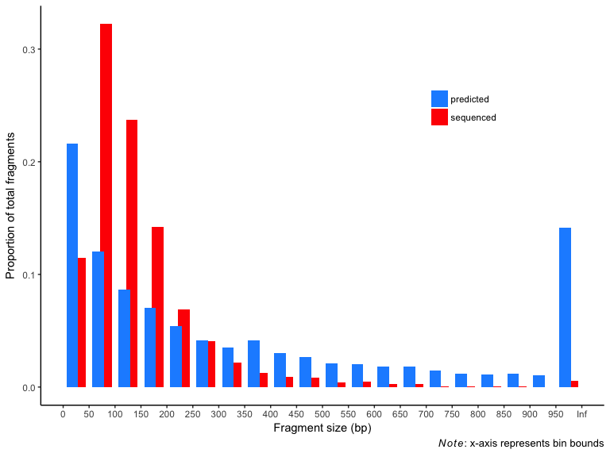
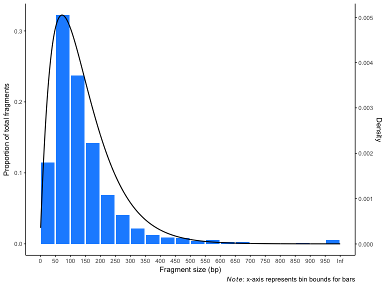
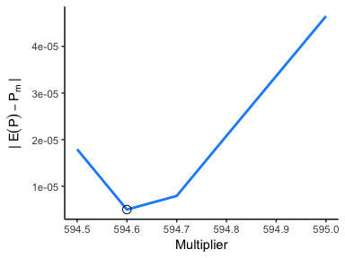

Filter digested fragments by size
================
Lucas Nell
19 March 2017

-   [Characterizing sequenced fragments](#characterizing-sequenced-fragments)
    -   [Proportion sequenced](#proportion-sequenced)
    -   [Data on distribution of fragments](#data-on-distribution-of-fragments)
    -   [Fitting a distribution for sequenced fragments](#fitting-a-distribution-for-sequenced-fragments)
-   [Reading in digestion fragments](#reading-in-digestion-fragments)
-   [Calibrating probability distribution for *ApeKI*](#calibrating-probability-distribution-for-apeki)
-   [Testing fragment filtering by size](#testing-fragment-filtering-by-size)
-   [Creating function to simulate size filtering](#creating-function-to-simulate-size-filtering)
-   [Session info and package versions](#session-info-and-package-versions)

*Updated 28 March 2017*

This script accounts for the fact that in GBS, many potential cut sites are not sequenced, and that the disparity appears to be at least partially driven by fragment size. I provide here the rationale for the objects in [`wr_size_filter.R`](./wr_size_filter.R) that filter digested fragments based on fragment size.

**Loading packages:**

``` r
suppressPackageStartupMessages({
    library(fitdistrplus)
    library(tidyr)
    library(purrr)
    library(readr)
    library(ggplot2)
    library(dplyr)
    library(magrittr)
    library(ShortRead)
})
```

Characterizing sequenced fragments
==================================

Proportion sequenced
--------------------

> From six sequencing lanes, we identified 809,651 sequence tags (at least five times) from one or both flanks of 654,998 of the 2.1 million *ApeKI* cut sites lying within the single copy genomic fraction.

([Elshire et al. 2011](http://dx.plos.org/10.1371/journal.pone.0019379), p 5)

From above, I've created below an object storing the proportion of cut sites that I'll assume get sequenced when using *ApeKI* in maize (as was done in the above study):

``` r
seq_p <- round(654998 / 2.1e6, 4)
```

Data on distribution of fragments
---------------------------------

I used WebPlotDigitizer (arohatgi.info/WebPlotDigitizer/) to extract data from Figure 3 in Elshire et al. (2011) to a csv file (`frag_sizes.csv`).

The below code cleans up the csv file. The `rounded_p` function rounds proportion data to 4 digits while having the summed proportions still add up to 1.

``` r
frag_sizes <- read_csv('./bg_data/frag_sizes.csv', col_types = 'cd') %>% 
    mutate(size = as.integer(rep(seq(50, 1000, 50), each = 2)),
           type = rep(c('predicted', 'sequenced'), 1000 / 50)) %>% 
    select(size, type, prop) %>% 
    group_by(type) %>%
    mutate(prop = rounded_p(prop)) %>%
    ungroup
```

This figure showed the difference between the fragment-size distribution (1) predicted from cut site locations in the maize genome and (2) from locations where reads were actually found when sequencing was performed. The figure is reproduced below.



Fitting a distribution for sequenced fragments
----------------------------------------------

I next want to fit a negative binomial distribution to the size-distribution of sequenced fragments. Because these data are binned (i.e., censored), I have to use the `fitdistcens` function from the `fitdistrplus` package. This function requires as input a data frame with columns named "left" and "right".

The code below creates the left and right values appropriately for each size bin (see `?fitdistcens`), then creates a data frame with *p* × *N* rows of the left and right values, where *N* is the total number of fragments and *p* is the proportion of total fragments represented by that size bin (i.e., the height of its bar in the plot above). I'm assuming here that the total number of fragments (*N*) is the 809,651 from the Elshire et al. (2011) quote at the top of this document.

``` r
cens_df <- frag_sizes %>% 
    filter(type == 'sequenced') %>% 
    split(.$size) %>% 
    map_df(
        function(.x, total_frags = 809651) {
            .left <- .x$size - 49
            .right <- ifelse(.x$size == 1000, NA, .x$size)
            N <- round(.x$prop * total_frags, 0)
            data_frame(left = rep(.left, N),  right = rep(.right, N))
        }
    )
```

Now I do the actual fitting using `fitdistcens`. (This took ~1 minute)

*Note*: Even though `fitdistcens` can't use a "tibble" data frame, I'm keeping `cens_df` in that format to keep me from accidentally printing &gt;800,000 rows.

``` r
seq_fit <- fitdistcens(as.data.frame(cens_df), 'nbinom')
summary(seq_fit)
```

    ## Fitting of the distribution ' nbinom ' By maximum likelihood on censored data 
    ## Parameters
    ##        estimate  Std. Error
    ## size   2.013446 0.003314013
    ## mu   144.829751 0.115487852
    ## Fixed parameters:
    ## data frame with 0 columns and 0 rows
    ## Loglikelihood:  -1601181   AIC:  3202366   BIC:  3202390 
    ## Correlation matrix:
    ##            size         mu
    ## size 1.00000000 0.01983402
    ## mu   0.01983402 1.00000000

I can now create a function to calculate the probability density for a given fragment size.

``` r
prob_dens <- function(frag_sizes) {
    dnbinom(frag_sizes, size = 2.013, mu = 144.8)
}
```

Here is the probability density function (black curve, right y-axis) along with the binned distribution of fragment sizes for sequenced reads (blue bars, left y-axis):



Reading in digestion fragments
==============================

I next need to read fasta files made using the code below that performs in silico digestions of the aphid genome using three different restriction enzymes (the same ones chosen in [dv\_digest.md](./dv_digest.md)). Note that this code should take a while to finish (~10 minutes).

``` r
source('wr_digest.R')
dna_ss <- read_fasta('./genome_data/aphid_genome.fa.gz')
dna_list <- lapply(c('ApeKI', 'BstBI', 'NruI-HF'), digest_genome, dna_ss = dna_ss)
write_fastas(dna_list, sprintf('./genome_data/frags_%s.fa.gz',
                               c('ApeKI', 'BstBI', 'NruI-HF')))
```

(See the `README.md` file for why I'm including `./genome_data/` in file paths.)

The below code reads these fasta files.

``` r
chosen_enz <- c('ApeKI', 'BstBI', 'NruI-HF')
dig_frags <- lapply(setNames(chosen_enz, chosen_enz), function(enz) {
    fasta <- readFasta(sprintf('./genome_data/frags_%s.fa.gz', enz))
    sread(fasta)
})
```

This is a data frame containing, for each restriction enzyme, all fragment lengths and their probability densities from the sequenced-fragment probability density function.

``` r
dig_frag_df <- lapply(chosen_enz, 
                      function(re){
                          .frag_len <- width(dig_frags[[re]])
                          .prob <- prob_dens(.frag_len)
                          .frag_index <- 1:length(.frag_len)
                          .df <- data_frame(enzyme = re, 
                                            frag_index = .frag_index,
                                            frag_len = .frag_len, 
                                            prob = .prob)
                          return(.df)
                      }) %>% 
    bind_rows
```

Calibrating probability distribution for *ApeKI*
================================================

From here, I could filter *ApeKI*-digested fragments using the following code:

``` r
dig_frag_df %>% 
    filter(enzyme == 'ApeKI') %>% 
    sample_frac(seq_p, weight = prob)
```

... which would give fragments with a higher probability density a greater chance of being selected and would give me the proportion I expect based on the maize-genome data.

If I did that for the other restriction enzymes, I would have to assume that the same proportion of fragments would be sequenced with them as with *ApeKI*. These restriction enzymes created longer average fragments than *ApeKI*, and we're assuming that fragment size is the primary determinant of whether a fragment is sequenced. Thus I decided not to use the sampling approach above.

What I decided on was to multiply the probability densities by a coefficient while limiting the new resulting probability to a maximum of 1:

*p*<sub>*i*</sub><sup>′</sup> = min({*β* × *p*<sub>*i*</sub>, 1})

where *β* is the selected coefficient and *p*<sub>*i*</sub> is the probability density of fragment *i*. I treated whether fragment *i* is sequenced as a Bernoulli trial with probability *p*<sub>*i*</sub><sup>′</sup>. The expected proportion of fragments sequenced (𝔼(*P*)) was calculated as the mean of all *p*<sub>*i*</sub><sup>′</sup> values.

<!-- LaTeX version:
\begin{align}
\mathbb{E}(P) = \frac{\sum_{i=1}^{n} p_i^{\prime} }{n}
\end{align}
where $n$ is the total number of fragments.
 -->
I tested multiple coefficients to find the one that minimized the absolute difference between the proportion of individuals we would predict would be selected from our *ApeKI*-digested, aphid-genome fragments (i.e., 𝔼(*P*)) and the proportion sequenced from the maize data in Elshire et al. (2011; *P*<sub>*m*</sub>).



The best coefficient (594.6) was assigned to object `prob_coef`.

Testing fragment filtering by size
==================================

In this section I test how the calibrated probability densities impact the proportion of fragments sequenced for all enzymes, using simulated Bernoulli trials.

The `fast_bern` function below quickly performs many Bernoulli trials, each with a unique probability (link to where I found it [here](http://r-bloggers.com/variable-probability-bernoulli-outcomes-fast-and-slow/)). It is ~75 faster than using `sapply` on a `rbinom(1,1,p)` call, and it returns a logical instead of a binary integer vector, which makes filtering simpler.

``` r
fast_bern <- function(p) {
    U <- runif(length(p),0,1)
    outcomes <- U < p
    return(outcomes)
}
```

The `test_filter` function filters the `dig_frag_df` data frame by values in the `prob` column multiplied by `prob_coef`, then it gets the number of rows present in the filtered data frame. It returns the proportion of fragments retained for sequencing.

``` r
test_filter <- function(enz) {
    filt_df <- filter(dig_frag_df, enzyme == enz)
    N <- nrow(filter(filt_df, fast_bern(prob * prob_coef)))
    return(N / nrow(filt_df))
}
```

Now I run the tests, and find that, as I intended, the proportion of sequenced reads decreases with restriction enzymes having fewer cut sites.

``` r
set.seed(329)
sapply(chosen_enz, function(e) sapply(1:100, function(i) test_filter(e))) %>% 
    as_data_frame %>% 
    gather(enzyme, prop) %>% 
    group_by(enzyme) %>% 
    summarize(`mean` = mean(prop), `sd` = sd(prop)) %>% 
    as.data.frame
```

    ##    enzyme       mean           sd
    ## 1   ApeKI 0.31189537 0.0003238056
    ## 2   BstBI 0.12898486 0.0003128048
    ## 3 NruI-HF 0.08376481 0.0004313927

Creating function to simulate size filtering
============================================

Now I am going to create a function to filter by fragment size. Because this function includes some stochasticity, it is intended to be used at a later point as part of the entire simulation procedure. I am saving it and other required objects in an `.RData` file to be loaded prior to simulations.

This function, `size_filter`, takes a single `DNAStringSet` as input, calculates the adjusted probability density (i.e., *p*<sub>*i*</sub><sup>′</sup>) according to the methods above, conducts Bernoulli trials for all fragments, then returns the filtered `DNAStringSet` object based on the trials.

``` r
size_filter <- function(dna_ss) {
    frag_sizes <- width(dna_ss)
    frag_probs <- prob_dens(frag_sizes) * prob_coef
    frag_keep <- fast_bern(frag_probs)
    return(dna_ss[frag_keep])
}
```

Example usage (with no filtering, this `DNAStringSet` has 318,022 sequences):

``` r
size_filter(dig_frags[['ApeKI']])
```

    ##   A DNAStringSet instance of length 99313
    ##         width seq
    ##     [1]   135 TTTACAATTGCTATTGTAACAATATATCA...AAAAATTGAAAAATGACAATGTCCGTAAG
    ##     [2]    39 CAGCTGAGGAAAGAGATGGATGGAGAGGAATTTGTTTGG
    ##     [3]   109 CTGCAGAATCCAGGCTTACCGGTTGAACC...TGAAGGTTGATTAAAACGTGAGTACATTG
    ##     [4]   139 CAGCTCAGTCCCAAATATAATATATTACT...CTACTTTTGTCGCAATGCTCCTAAAATCG
    ##     [5]   142 CAGCCCCCTCAGCCCCTCGCCTGGCTACG...CGGAACTTAAGGTTAGGTCCCGCACACAG
    ##     ...   ... ...
    ## [99309]   180 CTGCGCCCTCGGGTTCACGTTTTATAGTA...GGTCGACGGGTATTGTGTTTGTCGTGTTG
    ## [99310]   166 CTGCCGATGTGAATAACGTCAACGGTCCC...ACTTTGCCTAACCCAACCTAATCTAGTGG
    ## [99311]    87 CTGCCCACGTCTGTGAAACCTGCCCGAGT...CCGGGCTGTTCGGACTGGAAAGCTTTCGG
    ## [99312]    51 CAGCGGCTGATCTCCAAACTCGTCCTCGCTTATACCGATCCTTTTCTGCGG
    ## [99313]    15 CTGCCGCAAGTATCG

A version `size_filter` is found in file `wr_size_filter.R`. The only difference between that one and the one above is that the one in `wr_size_filter.R` contains the following objects within it:

-   `prob_coef`
-   `prob_dens`
-   `fast_bern`

`wr_size_filter.R` can be `source`d to do size filtering.

Session info and package versions
=================================

    ## Session info --------------------------------------------------------------

    ##  setting  value                       
    ##  version  R version 3.3.3 (2017-03-06)
    ##  system   x86_64, darwin13.4.0        
    ##  ui       X11                         
    ##  language (EN)                        
    ##  collate  en_US.UTF-8                 
    ##  tz       America/Chicago             
    ##  date     2017-03-28

    ## Packages ------------------------------------------------------------------

    ##  package              * version  date       source        
    ##  assertthat             0.1      2013-12-06 CRAN (R 3.3.0)
    ##  backports              1.0.5    2017-01-18 CRAN (R 3.3.2)
    ##  Biobase              * 2.34.0   2016-10-18 Bioconductor  
    ##  BiocGenerics         * 0.20.0   2016-10-18 Bioconductor  
    ##  BiocParallel         * 1.8.1    2016-10-30 Bioconductor  
    ##  Biostrings           * 2.42.1   2016-12-01 Bioconductor  
    ##  bitops                 1.0-6    2013-08-17 CRAN (R 3.3.0)
    ##  colorspace             1.3-2    2016-12-14 CRAN (R 3.3.2)
    ##  DBI                    0.6      2017-03-09 CRAN (R 3.3.2)
    ##  devtools               1.12.0   2016-06-24 CRAN (R 3.3.0)
    ##  digest                 0.6.12   2017-01-27 CRAN (R 3.3.2)
    ##  dplyr                * 0.5.0    2016-06-24 CRAN (R 3.3.0)
    ##  evaluate               0.10     2016-10-11 CRAN (R 3.3.0)
    ##  fitdistrplus         * 1.0-9    2017-03-24 CRAN (R 3.3.2)
    ##  GenomeInfoDb         * 1.10.3   2017-02-07 Bioconductor  
    ##  GenomicAlignments    * 1.10.1   2017-03-18 Bioconductor  
    ##  GenomicRanges        * 1.26.4   2017-03-18 Bioconductor  
    ##  ggplot2              * 2.2.1    2016-12-30 CRAN (R 3.3.2)
    ##  gtable                 0.2.0    2016-02-26 CRAN (R 3.3.0)
    ##  hms                    0.3      2016-11-22 CRAN (R 3.3.2)
    ##  htmltools              0.3.5    2016-03-21 CRAN (R 3.3.0)
    ##  hwriter                1.3.2    2014-09-10 CRAN (R 3.3.0)
    ##  IRanges              * 2.8.2    2017-03-18 Bioconductor  
    ##  knitr                  1.15.1   2016-11-22 CRAN (R 3.3.2)
    ##  labeling               0.3      2014-08-23 CRAN (R 3.3.0)
    ##  lattice                0.20-34  2016-09-06 CRAN (R 3.3.3)
    ##  latticeExtra           0.6-28   2016-02-09 CRAN (R 3.3.0)
    ##  lazyeval               0.2.0    2016-06-12 CRAN (R 3.3.0)
    ##  magrittr             * 1.5      2014-11-22 CRAN (R 3.3.0)
    ##  MASS                 * 7.3-45   2016-04-21 CRAN (R 3.3.3)
    ##  Matrix                 1.2-8    2017-01-20 CRAN (R 3.3.3)
    ##  memoise                1.0.0    2016-01-29 CRAN (R 3.3.0)
    ##  munsell                0.4.3    2016-02-13 CRAN (R 3.3.0)
    ##  plyr                   1.8.4    2016-06-08 CRAN (R 3.3.0)
    ##  purrr                * 0.2.2    2016-06-18 CRAN (R 3.3.0)
    ##  R6                     2.2.0    2016-10-05 CRAN (R 3.3.0)
    ##  RColorBrewer           1.1-2    2014-12-07 CRAN (R 3.3.0)
    ##  Rcpp                   0.12.10  2017-03-19 CRAN (R 3.3.2)
    ##  RCurl                  1.95-4.8 2016-03-01 CRAN (R 3.3.0)
    ##  readr                * 1.1.0    2017-03-22 CRAN (R 3.3.2)
    ##  rmarkdown              1.4      2017-03-24 CRAN (R 3.3.2)
    ##  rprojroot              1.2      2017-01-16 CRAN (R 3.3.2)
    ##  Rsamtools            * 1.26.1   2016-10-22 Bioconductor  
    ##  S4Vectors            * 0.12.2   2017-03-18 Bioconductor  
    ##  scales                 0.4.1    2016-11-09 CRAN (R 3.3.2)
    ##  ShortRead            * 1.32.1   2017-03-18 Bioconductor  
    ##  stringi                1.1.3    2017-03-21 CRAN (R 3.3.2)
    ##  stringr                1.2.0    2017-02-18 CRAN (R 3.3.2)
    ##  SummarizedExperiment * 1.4.0    2016-10-18 Bioconductor  
    ##  survival             * 2.41-2   2017-03-16 CRAN (R 3.3.2)
    ##  tibble                 1.2      2016-08-26 CRAN (R 3.3.0)
    ##  tidyr                * 0.6.1    2017-01-10 CRAN (R 3.3.2)
    ##  withr                  1.0.2    2016-06-20 CRAN (R 3.3.0)
    ##  XVector              * 0.14.1   2017-03-18 Bioconductor  
    ##  yaml                   2.1.14   2016-11-12 CRAN (R 3.3.2)
    ##  zlibbioc               1.20.0   2016-10-18 Bioconductor
